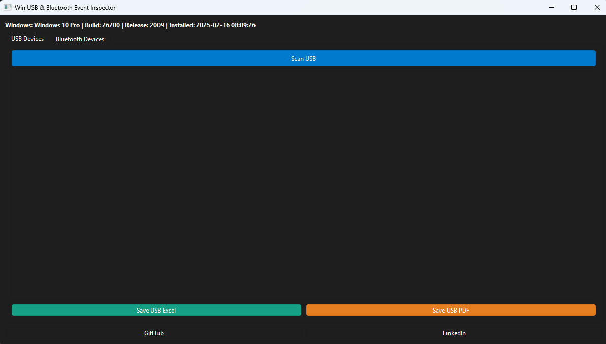
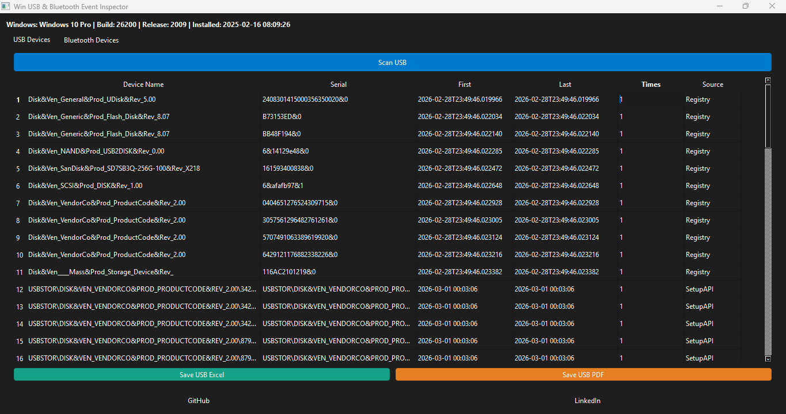
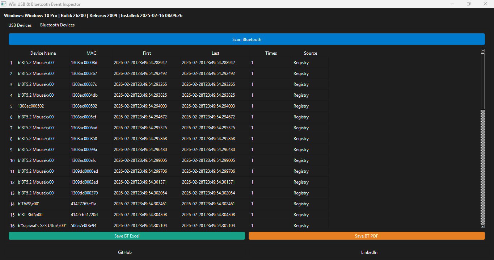

# 🔍 WinUSB & Bluetooth Event Inspector

<p align="center">
  
</p>

<p align="center">
  
  
  
  
  
</p>

---

## 🚀 Overview

**WinUSB & Bluetooth Event Inspector** is a Windows-based Digital Forensics tool designed to analyze USB and Bluetooth device connection artifacts using Windows Event Logs (EVTX), Registry traces, and system metadata.

Built for:

- 🕵 Digital Forensics Investigators (DFIR)
- 🛡 SOC Analysts
- 🚨 Incident Response Teams
- 🔬 Cybersecurity Researchers
- 🎓 Students & Security Enthusiasts

---

## ✨ Core Features

### 🔐 Security

- Automatic Administrator Privilege Detection
- Secure Event Log Inspection
- Controlled Report Generation
- Safe Local Database Handling

### 🔍 Log Inspection

- USB Device Connection History
- Bluetooth Pairing & Connection Logs
- First Connected Timestamp
- Last Connected Timestamp
- Device Serial / MAC Address
- Connection Frequency Tracking
- EVTX Parsing
- Windows Registry Artifact Inspection

### 📊 GUI Features

- Modern Dark Theme Interface
- Tab-Based Navigation
- Real-Time Scan Buttons
- Search & Filter Functionality
- Delete Log Entries
- Structured Data Table View

### 📁 Reporting

- Export to Excel (.xlsx)
- Export to PDF (.pdf)
- Windows System Metadata Included
- Professional Report Formatting

---

# 🖼 Application Screenshots

## 🖥 Dashboard

<p align="center">
  
</p>

---

## 🔌 USB Investigation Tab

<p align="center">
  
</p>

---

## 📶 Bluetooth Investigation Tab

<p align="center">
  
</p>

---

## 🛠 Technology Stack

| Technology | Purpose |
|------------|----------|
| Python 3.10+ | Core Programming |
| PySide6 | GUI Framework |
| Pandas | Data Processing |
| ReportLab | PDF Report Generation |
| python-evtx | Windows Event Log Parsing |
| Windows Registry | Artifact Extraction |

---

## 📦 Installation

```bash
git clone https://github.com/Sajawal-hacker/WinUSB-Bluetooth-Event-Inspector.git
cd WinUSB-Bluetooth-Event-Inspector
pip install -r requirements.txt
python main.py
```

---

## ⭐ Support This Project

If you find this project helpful, please consider giving it a ⭐ on GitHub.

It motivates further development and improvements.

<p align="center">
  <a href="https://github.com/Sajawal-hacker/WinUSB-Bluetooth-Event-Inspector">
    
  </a>
</p>

---

---

## 📬 Contact Me

If you have questions, collaboration ideas, or security research discussions:

- 💼 LinkedIn: https://www.linkedin.com/in/sajawalhacker
- 🌐 Portfolio: https://sajawalhacker.com/

I am always open to collaboration in Digital Forensics, SOC Operations, and Cybersecurity Research.

---

# 🌐 Follow me on my social media

<p align="center">

<a href="https://www.youtube.com/@Pakcyberdefence">
  
</a>

<a href="https://www.tiktok.com/@pakcyberdefence1">
  
</a>

<a href="https://www.linkedin.com/in/sajawalhacker/">
  
</a>

<a href="https://www.facebook.com/pakcyberdefence">
  
</a>

<a href="https://github.com/Sajawal-hacker/">
  
</a>

</p>

---

<p align="center">
  ⚡ Developed with Passion for Cybersecurity & Digital Forensics ⚡  
  🛡 DFIR | SOC | Incident Response | Threat Investigation
</p>

---

